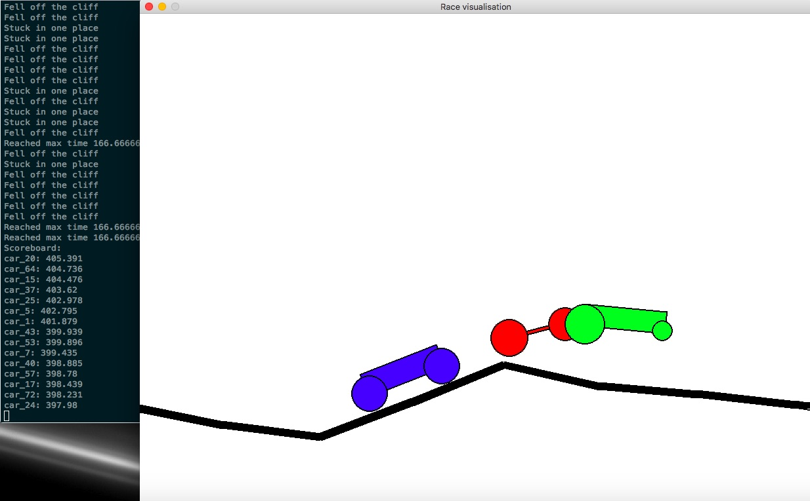

# 2D Locomotion Evolution

Simple project for evolving vehicles crossing a 2D landscape. Physics simulation using pybox2d, visualisation with pygame.

## How to run

For a quick start, run `python evolution.py`.
The code will simulate a race of 75 randomly generated simple cars on a random track. The result of each race (finished the course, stuck in place or exceeded total time) is printed to the console.
The individual vehicles are ranked based on distance (since they fall off the open end of the track, higher velocity translates to nigger reach) and 15 best ones are chosen, with results printed out. Those reproduce 5 times with random mutations to create the next generation.
The three best car races are visualised with the pygame package: to start the race press Enter (after focusing on the pygame window), to stop it or skip it, press Esc.
The whole process is repeated 10 times, showing evolution of the car design.

<!---->
 

## Description of modules

### `run_simulation.py`
Simple implementation of the pybox2d simulation. Creating an instance of the `Simulation` class creates the world as well as
the vehicle and track objects (using their own constructors). Class method `run` executes the simulation until the
vehicle doesn't move for more than `min_move` metres for `max_stuck_time` seconds; then returns the total distance
travelled.

(TODO: Write class docstrings, some way to check if the track was too short?)

### `visualise.py`

Simple visualisation using pygame. Initialises the pygame screen, opens the saved state history of a single
run, and draws the subsequent physics frames. 

(TODO: More colours and transparencies?)

### `state_history.py`

History of simulation states

Objects of class StateHistory keep the shapes (in correct positions) of all the
simulated bodies at each time step, so it can be saved and visualised
separately. See documentation of StateHistory.
Additional helper functions serve to extract the transformed shapes from body
attributes.

(TODO: more efficient history storing, saving to and loading from files)

### `evolution.py`

The main program and evolution loop. Should create the initial object population (choosing the appropriate class, but then
using own constructors to keep modularity), generate a track, run the simulation (calling appropriate functions from
`run_simulation.py` module) for each object, select the winners/losers, breed the winning objects (by using internal
methods) and repeat for a number of times.

(TODO: make nicer menu, tweak parameters)

### `track_generator.py`

Module with functions to create a track for vehicles. Should have a generation method that can produce the same track
for a given seed (so that every vehicle from the same population races on the same one), and a function to create the
appropriate pybox2d objects when called from `run_simulation.py`

(TODO: Add start and end points)

### `vehicle.py`

Actual implementation of the evolving vehicle. This module contains the base class Vehicle and all its derivatives (Car, Walker, etc.) To keep modularity of the code, all information and behaviour specific
to a certain vehicle type (car, walker, etc.) should be kept here. That means that we should be able to create initial
(random) objects, build their pybox2d representation in the simulation and breed them (create mutated offspring) only
by calling functions defined in this module.

(TODO: implement Walker, add efficient state history interface)

## Resources

We are using [pybox2d](https://github.com/pybox2d/pybox2d) ([manual](https://github.com/pybox2d/pybox2d/wiki/manual)) as the physics engine and [pygame](http://www.pygame.org/lofi.html) for handling the I/O (display in a window etc.).

### Installation instructions

Making sure that all the modules work together seems like the biggest trouble in this projects. Here's how I've finally managed to get pygame and pybox2d running on my macOS.
It's certainly not the only way to get it done, but it worked for me and hopefully will for you too.

1. Make sure you have pip and your default python installation is associated with it. (In my case I had to remove the version installed by MacPorts, by removing it completely: `sudo port -fp uninstall installed`)
2. Install pygame with pip: `pip install pygame`
3. Do **not** install pybox2d with pip, because it won't work. Instead let's build the `pybox2d_dev` package from source, following the instructions [here](https://github.com/pybox2d/pybox2d/blob/master/INSTALL.md#building-from-source-os-x)
